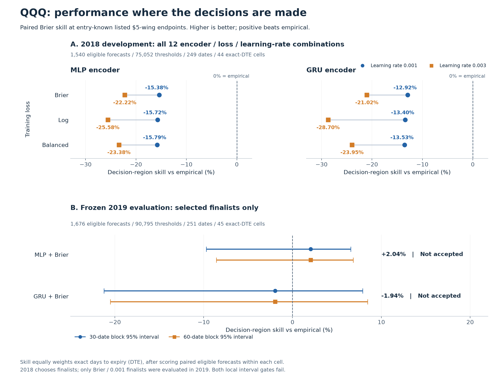
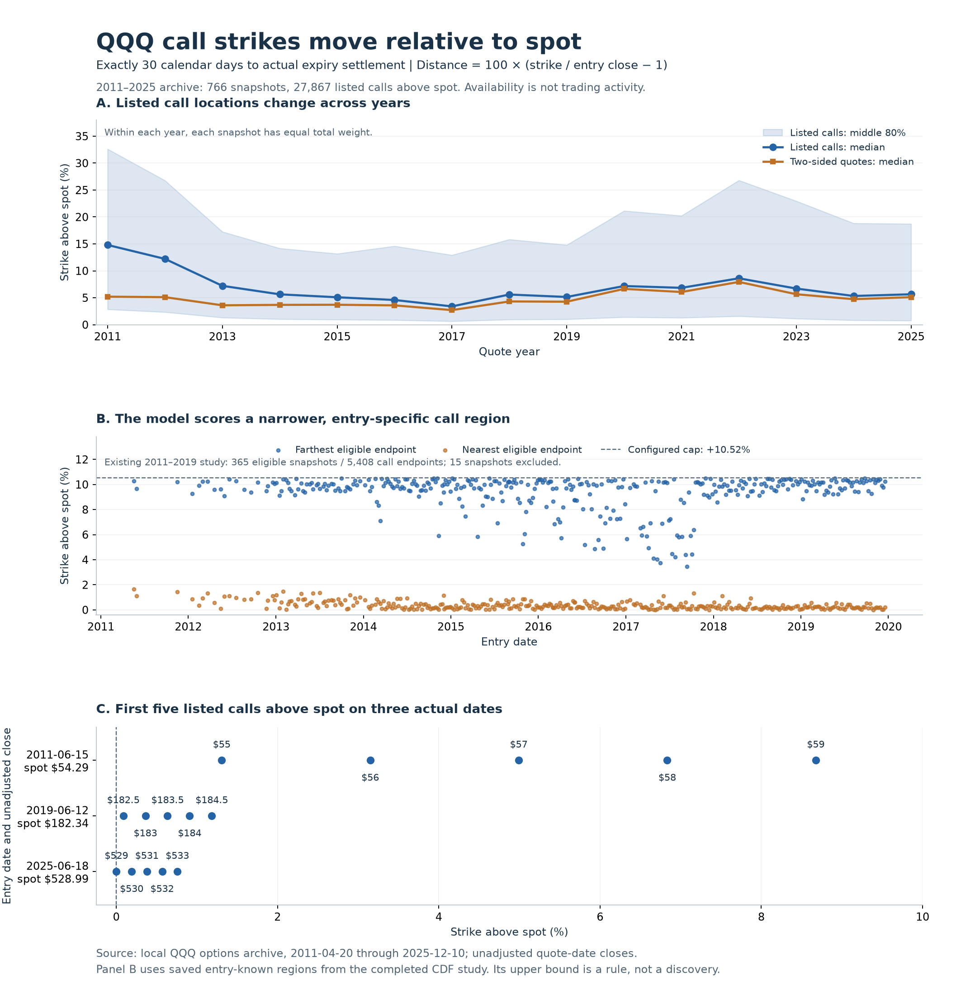

# QQQ Torch CDF: decision-region zoo

## TL;DR

The generic JSON-driven Torch framework and bounded zoo are complete. All 12
challengers lost to empirical on 2018 development. The selected MLP achieved
+2.043% primary skill in 2019, but both uncertainty intervals crossed zero.
Neither encoder passes the decision-region acceptance rule.

## Execution contract

The owner authorized ADR-0211 on 2026-10-01, superseding the earlier no-zoo
recommendation. Base: clean origin/main 8c269a46; reviewed implementation:
d2bbdd96. This is offline descriptive research, not a trading/profitability claim.

The response is terminal log return divided by entry-known reference scale.
The child joins exact QQQ/date/expiry snapshots, enumerates eligible listed
$5 wings, deduplicates their endpoints, and maps strikes to log(strike/spot)/scale.
Put and call sides each receive half the row weight. Outcomes cannot choose
strikes, wings, weights, or eligibility. The date-only archive supports indicative
after-close decisions, not executable quotes or a fully point-in-time acquired-data
claim. Sources, identities and clock are hashed.

Purged 2018 folds select one finalist per encoder before frozen 2019 evaluation.
Fit and calibration labels settle before their boundaries; 2018 development
also excludes labels settling in 2019. Both encoders use 22 entry-known return
lags plus context. The GRU reads oldest to newest within a row, never across
forecasts. All models share identities, features, scales, regions and splits.

## What the selected regions mean

The question is whether the forecast gets probabilities right at strikes that
could matter for an entry decision. Each QQQ/date/expiry uses its own listed
chain. Eligible condors have out-of-the-money puts and calls, exactly 5-dollar
wings, valid side-specific quotes and sizes, positive credit after the configured
fees, and every strike within an absolute log strike/spot distance of 0.1.
The region contains the distinct endpoints of **all** qualifying candidates,
not a winner chosen using the eventual outcome or a model's forecast.

Within a forecast, put endpoints share half the weight and call endpoints
share half. A strike repeated in several candidate condors is counted once.
These are discrete, entry-known decision thresholds; the score does not average
over an arbitrary whole-distribution grid. It also does not measure trading
profit or directly score the probability inside every wing interval.

At strike $K$, the model supplies the probability that the expiry price finishes
at or below $K$. This is its cumulative distribution function (CDF). The realized
answer is 1 if that event happens and 0 otherwise. The same entry-known scale
maps both strikes and terminal returns into comparable units. Forecasts without
eligible regions are excluded from local scores and counted explicitly.

## Models: same forecast, different encoders

Both neural models output a **three-component Gaussian mixture**: three smooth
bell-shaped distributions, each with a learned center, spread and weight.
Their weights sum to one, producing one coherent CDF. They differ in how the
entry features are processed before those mixture parameters are produced.

- **MLP (multilayer perceptron):** reads the 40 entry features together through
  32-unit and 16-unit hidden layers. The 22 return lags occupy fixed input
  positions; the other 18 features supply volatility, expiry/lifecycle,
  reference-scale and instrument context.
- **GRU (gated recurrent unit):** reads those same 22 lags oldest to newest,
  updating a 16-unit memory within each forecast. Its final memory joins the
  same 18 context features, followed by the same [32,16] mixture head.
  Memory resets for each row; forecasts cannot exchange future information.
- **Empirical reference:** estimates the training return distribution separately
  for each exact time to expiry, represented by 401 quantile knots. It learns
  no neural weights and uses no validation outcomes. Each challenger is compared
  with this actual fitted reference on the same eligible observations.

A larger sequence model is therefore being tested against both a simpler
feature model and a historical-distribution reference, under the same scoring
rules. This run does not establish that one architecture is generally superior.

## Loss functions: what training rewards

A loss is the error training tries to reduce. Let $p$ be the model's probability
of finishing at or below one selected strike, and $e$ its realized 0-or-1 answer.
Lower loss is better.

**Decision Brier** uses $(p-e)^2$. It penalizes probability errors at the selected
strikes. **Decision log** uses $-[e\log(p)+(1-e)\log(1-p)]$, with natural logarithms.
It penalizes confident wrong probabilities more sharply. Each local term first
averages strikes using the put/call-balanced weights, then averages eligible
forecasts. As an illustration, if $p=0.20$ and the event occurs, Brier is
$(0.20-1)^2=0.64$ and log loss is $-\log(0.20)=1.609$. These illustrate the
definitions, not an additional observation from the study.

**NLL (negative log likelihood)** is $-\log f(y)$, where $f$ is the model's
density and $y$ is the realized scaled return. It rewards placing density near
the full realized outcome, across all training rows. This term supplies
whole-distribution training information; it is not the primary acceptance metric.
Its coefficient does not imply a fixed percentage contribution because the
terms have different numerical scales.

The three JSON objectives, also used as the graph's loss labels, are:

| Graph label | Minimized training objective | Intended emphasis |
|---|---|---|
| Brier | 0.1 × NLL + decision Brier | Squared probability error in selected regions |
| Log | 0.1 × NLL + decision log | Stronger penalty for confidently wrong local probabilities |
| Balanced | 0.1 × NLL + decision Brier + 0.25 × decision log | Both local penalties, at the declared weights |

“Balanced” names this fixed combination; it does not mean the contributions
are equal or the weights were optimized. Every candidate, whatever its training
loss, is ranked by the same held-out decision Brier skill. Comparing composite
loss magnitudes across different objectives would not rank forecast quality.

## Graph: performance in the selected regions

Panel A compares every tested encoder and loss at both learning rates on the
2018 development holdout. Brier at 0.001 leads within both encoders; all twelve
remain worse than empirical. The loss labels refer to the complete composites
above, each including 0.1 × NLL. Lines connect the two learning rates within a
model/loss pair; they are not uncertainty intervals.

Panel B evaluates only the frozen winners in 2019, after the declared refit.
Its bars are pointwise 95% intervals from 30-date and 60-date paired block
bootstraps. The MLP point is positive, but neither finalist's lower bounds
exceed zero. The other ten configurations were not tested in 2019, so this
panel cannot rank all three loss functions on the later year.

All plotted skill is the primary, equal-exact-DTE **selected-region** score.
Zero means matching empirical; positive means lower local Brier error. This
is not generic tail skill, global distribution fit, or in-sample training skill.
The exact values, observation counts and loss reports follow below.

The figure is rendered directly from the hash-verified selection/selected.json
(skill_pct, raw variants) and report/comparison.json
(decision_acceptance, points and intervals), whose hashes are recorded below.
The PNG is a tracked memo asset; no new fit, HPO or selection was performed.

## Implementation and search

TorchCDF extends the existing analytic Gaussian-mixture seam. JSON chooses MLP
or GRU and weighted proper-score terms; generic code contains no index, provider,
or column choice. DecisionRegionScores consumes generic identity-bound
thresholds; the child owns listed-wing eligibility and source-clock validation.

Twelve candidates = two encoders × three losses × two learning rates
(0.001/0.003). All use three mixture components, [32,16] output layers, 12 fixed
epochs, batch size 512, seed 11 and deterministic CUDA. GRU has one 16-unit
recurrent layer. No early stopping or later-year reselection. Calibration is
disabled; saved raw/calibrated rows are identical and raw wins the tie.

Losses: Brier = 0.1 NLL + local Brier; log = 0.1 NLL + local Bernoulli log score;
balanced = 0.1 NLL + local Brier + 0.25 local log score. NLL uses all rows.
Local terms divide by eligible rows; minibatches use the full-training eligible
fraction so empty batches cannot dilute the declared weight. Float64 preserves
exact threshold/outcome events in training and reporting.

Primary skill = 100 × (1 − mean over exact-DTE cells of candidate Brier /
empirical Brier). Each cell averages paired eligible forecasts, each forecast
uses side-balanced listed thresholds. HPO uses 44 development cells; later
evaluation uses 45. The purged 2018 26-day cell is absent.

Acceptance requires both 30/60-date bootstrap lower bounds above zero and
equal-cell absolute local calibration-bias increase at most 0.01. Circular
date blocks retain same-date pairs; 1,000 replicates. Global/tail/constructed-wing
scores are diagnostics only. Intervals are pointwise, not multiplicity-adjusted;
historical years were previously inspected, so even a pass remains descriptive.

## Development losses, skill and observations

Common counts: training 7,799 rows / 7,239 eligible / 167,154 thresholds /
1,452 dates; calibration 1,534 / 1,487 / 48,138 / 250; validation 1,550 /
1,540 / 75,052 / 249. Composite magnitudes across different losses are not
rankings. Training skill is in-sample; validation skill is out-of-sample.

| Candidate | Train loss | Validation loss | Train skill % | 2018 skill % |
|---|---:|---:|---:|---:|
| mlp_brier_slow | 0.226378 | 0.298807 | +2.583 | -15.376 |
| mlp_brier_fast | 0.210254 | 0.317014 | +8.912 | -22.223 |
| mlp_log_slow | 0.427533 | 0.604393 | +2.603 | -15.720 |
| mlp_log_fast | 0.397972 | 0.665509 | +8.760 | -25.580 |
| mlp_balanced_slow | 0.300376 | 0.412146 | +2.630 | -15.788 |
| mlp_balanced_fast | 0.278991 | 0.441429 | +9.018 | -23.376 |
| gru_brier_slow | 0.223474 | 0.295309 | +4.051 | -12.919 |
| gru_brier_fast | 0.211774 | 0.305507 | +8.401 | -21.015 |
| gru_log_slow | 0.423570 | 0.598088 | +3.761 | -13.402 |
| gru_log_fast | 0.398528 | 0.659260 | +8.284 | -28.697 |
| gru_balanced_slow | 0.296884 | 0.407155 | +3.983 | -13.533 |
| gru_balanced_fast | 0.280149 | 0.427551 | +8.533 | -23.949 |

The frozen finalists, mlp_brier_slow and gru_brier_slow, are the least-bad
development challengers, not development successes.

## Frozen 2019 results

Refit training: 9,419 rows / 8,812 eligible / 218,061 thresholds / 1,703 dates.
Calibration: 1,550 / 1,540 / 75,052 / 249.
Validation: 1,677 / 1,676 / 90,795 / 251, across 60 expiry series.
Excluded observations are counted, never scored as zero.

| Finalist / band | Composite loss | NLL | Local Brier | Decision skill % |
|---|---:|---:|---:|---:|
| mlp_brier_slow / training | 0.224824 | 1.325264 | 0.092298 | +0.977 |
| mlp_brier_slow / calibration | 0.298487 | 1.542281 | 0.144259 | -9.885 |
| mlp_brier_slow / validation | 0.253221 | 1.399726 | 0.113248 | +2.043 |
| gru_brier_slow / training | 0.217539 | 1.281103 | 0.089429 | +3.753 |
| gru_brier_slow / calibration | 0.300151 | 1.534694 | 0.146682 | -14.674 |
| gru_brier_slow / validation | 0.262377 | 1.439589 | 0.118418 | -1.944 |

For example, MLP validation loss = 0.1 × 1.399726 + 0.113248 = 0.253221.
NLL averages 1,677 rows; local Brier averages 1,676 eligible rows. Telemetry
uses the actual configured empirical fit and preprocessing. Calibration is
held out from fitting but is not the final test.

| Finalist | Skill % | 30-date interval % | 60-date interval % | Local bias increase | Accept? |
|---|---:|---:|---:|---:|---|
| mlp_brier_slow | +2.043 | [-9.708, +6.550] | [-8.567, +6.834] | -0.007675 | No |
| gru_brier_slow | -1.944 | [-21.228, +7.894] | [-20.515, +8.456] | -0.005798 | No |

The MLP's mean of 45 paired cell-score ratios is 0.979566:
100 × (1 − 0.979566) = +2.0434%. Its lower bounds −9.7075% and −8.5671%
both fail the required zero. Bias change −0.007675 passes the +0.01 limit.
GRU also passes local bias and fails both intervals.

Equal-DTE weighting matters: pooled row-average Brier is worse than empirical
for both finalists (MLP 0.113248; GRU 0.118418; empirical 0.109361). The positive
MLP primary point estimate is therefore not a broad row-average gain.
Global CRPS row means are 0.589682/0.600470 versus empirical 0.562838;
tail-score means are 0.364390/0.364014 versus 0.346241. These are diagnostics only.

## 30-day call-region census

**The call strikes do not sit at fixed percentages above spot.** This
2026-10-01 follow-up measures locations in archived chains. It does not refit
forecasts, score additional outcomes or change the model's region rule.

The scope is every archived QQQ snapshot with exactly **30 calendar days to
actual expiry settlement**, from 2011-04-20 through 2025-12-10: 766 snapshots
on 766 dates. As in the CDF study, settlement is the last XNYS session on or
before the listed expiration date; old Saturday expirations map to Friday.
Exactly-30-day availability is a subset of quote dates, not every day or a
25–35-day approximation.

Distance is 100 × (strike / unadjusted entry close − 1), in percentage points
above spot. There are 68,722 call strike/date/expiry rows, including strikes
below spot. The results focus on the **27,867 calls strictly above spot**.
Each snapshot has equal total weight; its included strikes have equal weights.
These are listing counts, not trading-volume or open-interest weights.

### Where the strikes fall

| Population | Period | Snapshots | Strike observations | 10th percentile | Median | 90th percentile |
|---|---|---:|---:|---:|---:|---:|
| All listed calls above spot | 2011–2025 | 766 | 27,867 | +1.05% | +6.04% | +18.86% |
| Positive two-sided quotes and sizes | 2011–2025 | 766 | 22,988 | +0.86% | +4.65% | +12.83% |
| Existing model's eligible call endpoints | 2011–2019 | 365 | 5,408 | +0.70% | +4.41% | +9.11% |

These percentiles describe strike locations, not event probabilities or
confidence intervals. The middle 80% runs from the 10th to 90th percentile.
Positive two-sided quotes mean finite bid/ask, bid > 0, ask ≥ bid and positive
bid/ask sizes: an availability filter, not evidence of executable liquidity.

The model-region row uses 365 eligible snapshots out of 380 exact-30-day study
snapshots in 2011–2019; the other 15 have no qualifying condor. To separate the
filter from the date range: on those **same 365 snapshots**, all listed calls
above spot have 10th/50th/90th percentiles **+0.96% / +5.28% / +15.55%**
(8,525 observations), versus **+0.70% / +4.41% / +9.11%** for the 5,408
eligible endpoints.

Across all 766 snapshots, the median nearest call is **+0.18%** above spot;
the middle 90% of nearest-strike distances runs from **+0.02% to +0.78%**.
The median farthest listed call is **+19.91%**, with a middle-90% range of
**+7.02% to +46.93%** across snapshots. Early coverage is sparse: 2011 has
only 12 exact-30-day snapshots, of which three have eligible study regions.

### Actual examples

These are the available exact-30-day snapshots nearest June 15 in each
selected year, chosen by date without looking at outcomes.

| Entry date | Entry close | First call above spot | Distance | Next call | Next distance |
|---|---:|---:|---:|---:|---:|
| 2011-06-15 | $54.29 | $55 | +1.308% | $56 | +3.150% |
| 2019-06-12 | $182.34 | $182.5 | +0.088% | $183 | +0.362% |
| 2025-06-18 | $528.99 | $529 | +0.002% | $530 | +0.191% |

For the 2019 example, 100 × (182.50 / 182.34 − 1) = **0.08775%**.
Strikes are in dollars; percentage spacing changes with spot and the listed
increments. A fixed +5% target is not guaranteed: only **45.82% of snapshots**
have a listed above-spot call within **0.1 percentage points** of +5%.

### Implication for the scored region

The existing log-moneyness cap of 0.1 imposes a call-side ceiling of
100 × (exp(0.1) − 1) = **+10.517%**. This is a configured limit, not a
boundary discovered in the archive. Eligible endpoints also depend on listed
$5 wings, both sides' quote checks and positive net condor credit.

A fixed $5 wing is **9.21%** of the $54.29 entry price in the 2011 example,
but **0.95%** of $528.99 in the 2025 example. This illustrates the changing
relative width of the rule; 2025 decision eligibility was not computed.
The 2011 example has no qualifying condor under the saved study rule.

The evidence supports deriving regions from each entry's actual chain.
For interpreting skill, show distance bands within those regions alongside
days to expiry: one pooled call score can mix different strike distances and
grid densities. This census adopts no new band or model-selection rule.

### Census evidence and reproduction

The WSL scan read entry chain fields and quote-date closes from 15 local
yearly files; no provider request, model fit or later outcome scoring.
It scanned 15,345,882 option rows in **4.67 seconds**, with peak process RSS
**522.25 MiB**, inside the enforced 1740s / 6 GiB / no-swap envelope.
Summaries and the plot then operated on the small retained extracts.

Local artifacts:
 /home/russell/dskit-torch-decision-cdf/children/index_options/pipeline_runs/qqq_call_region_census_20261001.
They include protocol.json (source paths/hashes, definitions and counts),
listed_calls.parquet, decision_call_endpoints.parquet, per-population snapshot
CSVs and summary.json. Reproduction: resolve actual expiry via XNYS, retain
exactly 30 days, join unadjusted closes by quote date, calculate the distance,
then apply the populations and weights above. Weighted endpoint quantiles
invert the weighted cumulative distribution; per-snapshot quantiles use linear
interpolation. The plotted bands describe distributions, not uncertainty.

All 5,408 reconstructed decision strikes match listed calls one-to-one on
date/expiry/strike, and study spots equal archive closes exactly on those rows.
Duplicate keys, missing closes, nonfinite prices and non-session quote dates
were checked. Figure values come from saved summaries and the rendered graph
was visually inspected. Original model code/configs and evidence are unchanged;
no test suite was rerun for this evidence-only extension.

Census summary SHA256: fd258c0497f8e20c9612eeb438b9c31548a83dbddeb7077b7d339f33cab5893e.

## Execution and verification
Six final standard CLI stages completed in 251.381s combined (4m11s).
Maximum process RSS was 2.434 GiB; peak Torch CUDA allocation 257.2 MiB.
Every invocation had enforced systemd MemoryMax=6G, MemorySwapMax=0 and
RuntimeMaxSec=1740; recorded swap peaks were zero. Full service times include
data loading; completion stage times exclude earlier loading. Some short-lived
service summaries under-report memory, so peak above uses process ru_maxrss.
CUDA allocation excludes driver memory. GPU: RTX 5060 Ti.

Focused checks: 233 passed across the CDF pack, child CDF and pipeline purity;
26 upstream deprecation warnings. No unrelated full suite. Ruff adds zero
violations versus base. Independent final correctness and integration lenses
both returned C0/M0/m0/n0 on d2bbdd96; integration independently recomputed
all 12 development skills/counts and checked both evaluation partitions.
See docs/review-evidence/ADR-0211.md for retained findings and corrections.

Preserved attempts: a 23s pre-fit interruption after review; a 26s metadata
census refusal; two completed search-only screens superseded by the population
denominator correction. None supplied final selections or later evidence.
WSL briefly returned E_UNEXPECTED, then recovered without a shared-instance
restart. No completed result was overwritten or reconstructed from partial output.

Only the 12-candidate zoo ran. The two-candidate smoke JSON was validated but
deliberately not executed. No SPY run, unseen-period validation, broader search,
optimizer/backtest, provider pull, paper/live execution or deployment occurred.

## Reproduction and handoff

Use configs/run-predictive-cdf-qqq-torch-zoo.json through the existing
python -m index_options.cdf_study CLI. Ordered stage arguments:

1. --stage search --partition mlp
2. --stage search --partition gru
3. --stage select
4. --stage evaluate --partition development
5. --stage evaluate --partition later
6. --stage report

From the WSL child directory, append one argument set to this command:

    systemd-run --user --wait --pipe --property=MemoryMax=6G \
      --property=MemorySwapMax=0 --property=RuntimeMaxSec=1740 \
      --working-directory="$PWD" /usr/bin/env \
      PYTHONPATH="$PWD/../..:$PWD" OMP_NUM_THREADS=1 OPENBLAS_NUM_THREADS=1 \
      CUBLAS_WORKSPACE_CONFIG=:4096:8 /home/russell/dskit/.venv/bin/python \
      -m index_options.cdf_study configs/run-predictive-cdf-qqq-torch-zoo.json

Completed roots refuse overwrite: reruns need new output paths in copied JSON.
The standard two-epoch smoke document uses the same stages and both encoders.

Local run root: `/home/russell/dskit-torch-decision-cdf/children/index_options/pipeline_runs/qqq_torch_cdf_20261001_r2`.
Logs: sibling `qqq_torch_logs/final-*.log`. Counts preserve loss terms,
eligible/total/threshold/date denominators and training mini-batch curves.
Protocols, source hashes, versions, panels, scores, frozen curves, selection
and hash-checked completion manifests remain local. Generated artifacts are
Git-ignored; this memo and code/configuration are tracked.

- Full experiment identity: `2c2fb7419edfdc0915b0153e3b6dabbfba92289d7ecebd2ff5bc989831bd2005`.
- selection/selected.json SHA256: `37158e4ff6456cfe874845cc2e14e0f1b234551b62775ca137b2f53d7714d2ec`.
- report/comparison.json SHA256: `f3025a819e12a4221359223f6194a5180e37295fb4c2ec7bb83123e32af71740`.
- report/complete.json SHA256: `ac23595dad9e6d2b1e9dfb5994367cca1fbfeccca7d75ac7300aa500ceab8af7`.

The bounded study is complete. Keep the empirical reference and both
challengers unaccepted. Further tuning or a new-year test needs a separately
declared study; these results do not authorize optimization.
