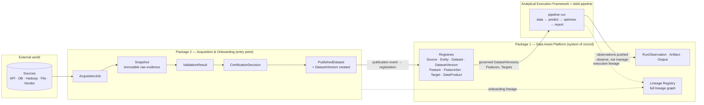

# Context & Ownership Map

*Foundation for Deliverable #4 (Package Interaction Specification) of both master
specs. Source of truth for **who owns what** and **how the three packages
interact**. Everything here is grounded in
[`../agent-master-specifications.md`](../agent-master-specifications.md); anything
not settled by the specs is called out and pushed to
[open-questions.md](open-questions.md) or [decision-log.md](decision-log.md).*

## 1. The one-paragraph model

Data enters through **Package 2** (Acquisition & Onboarding), which acquires it,
snapshots the raw evidence immutably, validates it, certifies it, and **publishes
a governed `DatasetVersion`**. **Package 1** (Data Asset Platform) is the
**system of record**: it registers that `DatasetVersion` and catalogs the durable
assets around it (sources, entities, features, targets, data products) with full
lineage and immutable, versioned history. The **Analytical Execution Framework**
(`dskit.pipeline`) consumes governed datasets/features/targets, runs the pipeline,
and **pushes run observations, artifacts, and outputs back to Package 1**, which
**observes** execution rather than managing it.

## 2. End-to-end data flow

The three boundaries that carry traffic — and therefore need a Package Interaction
contract — are the labelled edges:

1. **Publication → Registration** (P2 → P1): the handoff of a certified
   `DatasetVersion` into the system of record.
2. **Governed assets → Execution** (P1 → pipeline): the engine reads only
   registered, versioned datasets/features/targets.
3. **Observation** (pipeline → P1): run records flow back; P1 never triggers runs.

## 3. Ownership — Package 1 (Data Asset Platform)

| Owns (registries) | Explicitly does **not** own |
|---|---|
| Source · Entity · Dataset · **Dataset Version** · Data Product | Data acquisition |
| Feature · Feature Version · Feature Set | Pipeline execution · Scheduling · Orchestration |
| Target | Model training · Forecasting · Optimization · Scoring |
| Run Observation · Artifact · Output | Valuation execution |
| Lineage | |

**Core principles.** Asset-centric · entity-centric · full lineage · immutable
history · version everything · reuse before duplication · **observe execution
rather than manage it**.

**Governance rules (from the spec).**
- *Features belong to entities*, never directly to analytical models; features are
  reusable platform assets.
- *Targets are independent assets*, stored separately from features, and joined to
  features **only in run-specific artifacts** — never in the registries.

## 4. Ownership — Package 2 (Acquisition & Onboarding)

| Owns | Explicitly does **not** own |
|---|---|
| Source Registration · Acquisition | Feature engineering business logic |
| Raw Snapshot Storage | Analytical execution · Training · Scoring |
| Validation · Certification | Optimization · Forecasting |
| Publication · **Dataset Version Creation** | Valuation logic |
| Onboarding Lineage | |

**Core principles.** Snapshot everything · preserve raw evidence · validate before
publish · certify before registration · support reproducibility · **separate
acquisition from consumption**.

**Data-management rules (from the spec).**
- Every acquisition creates an **immutable snapshot**; every snapshot carries its
  acquisition metadata; every certified dataset is traceable to a source.
- **Time series:** maintain both an *effective date* and an *acquisition date*;
  store **forecasts independently** from historical observations.
- **Join policy:** features and targets are **not** joined here — this package
  publishes governed datasets only.

## 5. Shared objects & boundary resolutions

The two specs name overlapping objects. Each overlap is a boundary that must be
resolved before either domain model is frozen. Proposed resolutions below are
recorded as ADRs; unresolved ones are open questions.

| Object | Package 2 view | Package 1 view | Boundary | Resolution |
|---|---|---|---|---|
| **Source** | "Source Registration" (operational onboarding) | "Source Registry" (authoritative catalog) | Two registries or one? | P2's registration is operational; P1 holds the authoritative catalog — [ADR-0003](decision-log.md#adr-0003--package-2s-registration-of-a-source-is-operational-package-1-holds-the-authoritative-catalog) (closed OQ-1) |
| **DatasetVersion** | "Dataset Version **Creation**" + PublishedDataset | "Dataset Version **Registry**" (record of truth) | Who creates vs. records? | P2 **creates & publishes**; P1 **registers**. Publication event is the handoff — [ADR-0002](decision-log.md#adr-0002--datasetversion-is-created-in-package-2-registered-in-package-1) |
| **Lineage** | "Onboarding Lineage" (LineageRecord) | "Lineage Registry" (global LineageRelationship graph) | How do they compose? | Layered: P2 emits onboarding-phase lineage; P1 holds the global graph; pipeline emits execution lineage — [ADR-0004](decision-log.md#adr-0004--lineage-is-layered-onboarding--execution--global-graph) |
| **RunObservation / Artifact / Output** | — | owned by P1 | How does the engine populate them? | Pipeline **pushes**; P1 observes, never manages — [ADR-0005](decision-log.md#adr-0005--package-1-observes-execution-it-never-triggers-it) |
| **Feature / Target** | excluded ("no feature engineering") | registries owned, but "does not own feature engineering" | Who computes and registers them? | pipeline computes; P1 observes via the file seam — [ADR-0008](decision-log.md#adr-0008--pipelineassets-observation-is-file-based-no-imports-either-way) (closed OQ-3) |

## 6. Everything this map deferred is now settled

OQ-1…OQ-7 are all closed — see [open-questions.md](open-questions.md) for
each ruling's ADR. This map predates those closures; where a row above and
an ADR disagree, the ADR wins.
