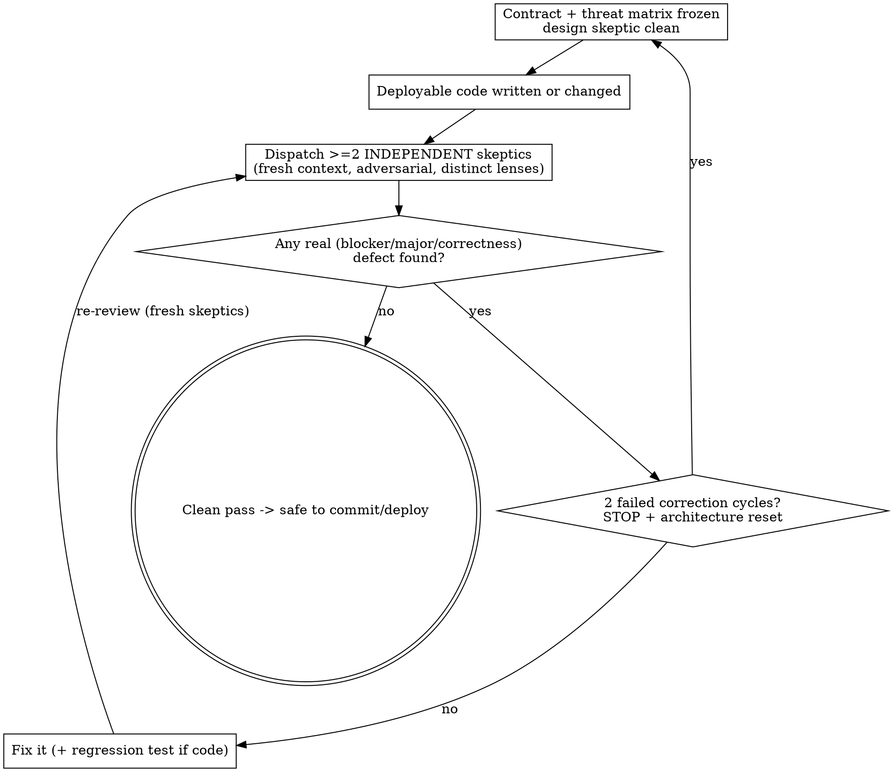

# Skeptic Review Loop

## Overview

Deployable code is not done when tests pass — it is done when **independent skeptics find nothing wrong on a fresh pass**. Every piece of code written to be deployed must survive adversarial review by independent reviewers, and **every fix restarts that review**. The loop ends only on a clean independent pass.

**Core principle:** The author is blindest to their own bug. Passing tests prove the code does what the author *imagined*; they do not prove the imagination was right. Only a fresh, independent, adversarial reader closes that gap.

**You do not adjudicate your own review.** Severity, whether a skeptic genuinely tried to break the code, and the final clean-pass verdict belong to the independent skeptics — never to the author. Author self-judgement is the exact blind spot this loop exists to defeat, so any gate you can quietly relabel — a "nit," "not a real finding," "just exploration," "good enough" — is not a gate.

**Violating the letter of this loop is violating its spirit.** A self re-read, a single review round, or "it's only a one-line fix" all defeat the purpose.

## The Iron Law

```
NO DEPLOYABLE CODE IS "DONE" UNTIL AN INDEPENDENT SKEPTIC PASS FINDS ZERO REAL DEFECTS.
```

Applies to every commit / merge / deploy of production-bound code — new modules, bug fixes, refactors, and analysis / report / plot scripts whose output drives a decision.

## Phase 0 — Convergence Before Code

Run this gate before RED when a change crosses a trust/security boundary, changes
identity or persistent state, coordinates multiple public entry points or lifecycle
stages, or can cause an irreversible external effect. Ordinary local changes may go
straight to TDD.

1. **Inventory first.** Map existing seams and prove the capability is missing or
   insufficient. Do not design around a partial search.
2. **Freeze the contract.** State actors, authority, trusted and untrusted inputs,
   identities, state transitions, allowed outputs, forbidden side effects,
   compatibility promises, and explicit non-goals.
3. **Build the attack matrix.** For every invariant, record the failure/attack
   class, every public entry point, expected result, forbidden side effect, and the
   focused test or other evidence that will prove it.
4. **Use an independent design skeptic.** Give it the contract and inventory, not a
   proposed implementation. It must try to falsify boundaries, add missing attack
   classes, and identify coupled responsibilities.
5. **Resolve design findings first.** Start implementation only after the matrix is
   frozen and the design skeptic reports zero unresolved blocker/major/correctness
   findings. Material architecture or authority decisions require their normal
   owner/ADR approval.

The author may draft the matrix, but may not be its only adversary. The matrix is a
review boundary, not a prediction that later reviewers are forbidden to exceed.
Newly discovered attack classes are added to it permanently.

Minimum attack classes, when applicable:

- malformed, aliased, duplicated, nested, subclassed, and mutation-during-read input;
- authorization order, expiry/revocation, confused-deputy, and authority substitution;
- identity/hash/default/path substitution and canonicalization;
- partial failure, retry, crash/restart, replay, and concurrent state transition;
- pre-validation import/open/write/network effects and TOCTOU;
- every public facade, adapter, CLI, direct constructor, and compatibility route.

## When to Use

- Before committing, merging, or deploying any code meant to run for real.
- **Immediately after applying a fix during a review** — the fix is new code and re-enters the loop.
- Even when: the tests pass, coverage is green, the diff is tiny, the user is waiting, or the user said "ship it."

**When NOT to use:** throwaway scratch/exploration you will actually delete, or a pure question with no code change. Deploy-bound or decision-driving code is never "throwaway," whatever you label it.

## The Loop



## Rules

1. **≥2 independent skeptics, with distinct lenses.** Dispatch at least two fresh reviewers (subagents with clean context) that are independent *of each other*, not only of you: each gets a DIFFERENT lens — e.g. correctness, data-integrity/robustness, test-quality. Two reviewers running the same prompt are one viewpoint and do not satisfy this. Scale up for higher-stakes code.
2. **Independent means NOT you.** The author re-reading their own diff does not count and has near-zero marginal value on the blind spot. A skeptic is a separate context.
3. **Adversarial, and the skeptic assigns severity.** Prompt each skeptic to FIND a defect and PROVE it (run code, worked examples) — never prompt for approval ("confirm this looks fine") and never scope them away from the riskiest path. Whether a finding is a blocker/major/correctness issue or a nit is the *skeptic's* call, not the author's.
4. **Every fix re-runs the loop.** A found bug RAISES the prior that another exists, and a "one-line fix" is a top source of new bugs. After ANY change, re-dispatch fresh skeptics.
5. **Stop only on a clean independent pass** — a fresh round with zero blocker/major/correctness findings. Not on a self re-read, not on a fixed round count, not when you "feel done." Nits may be noted and deferred without restarting; but if you change code to address one, that edit is new code and re-enters the loop (Rule 4). *Any* correctness finding restarts the loop — regardless of who would prefer to call it minor.
6. **Complete the round; batch the findings.** A skeptic does not stop at the first
   defect. It continues until its assigned lens and the frozen attack matrix are
   exhausted, then returns all proven findings together. Early return is allowed
   only when continuing would be unsafe or genuinely blocked. A round that reports
   one bug without auditing equivalent entry points and attack classes is incomplete.
7. **Fix, don't argue.** Address a real finding (with a regression test where it's code), then re-review. You may NOT unilaterally dismiss a finding as invalid to escape both fixing and re-reviewing — a disputed finding goes to a fresh skeptic to adjudicate, not to the author's veto.
8. **Two failed correction cycles force an architecture reset.** A failed
   correction cycle is `review finds correctness defect -> correction -> fresh
   review finds another correctness defect`. After two consecutive failed cycles,
   do not make a third patch. Preserve the evidence, declare non-convergence, and
   return to Phase 0. Identify the shared design failure, shrink or repartition the
   boundary, replace the contract/threat matrix, obtain any required approval, then
   restart implementation and the clean-review count. Time pressure cannot waive
   this circuit breaker.
9. **Keep a round ledger.** Record the immutable reviewed commit, matrix revision,
   reviewer and lens, exact tests/evidence, every finding and disposition, correction
   commit, and result. This makes repeated defect classes and non-convergence visible.
10. **The trace is the skeptics' own output.** Keep the reviewers' returned verdicts/findings themselves (their transcripts, IDs, or verbatim reports) plus how each finding was resolved — never an author-written summary that merely *asserts* a skeptic said PASS. A self-authored trace proves nothing; the artifact must be independently produced. A loop you cannot show in the skeptics' own words is a loop you did not run.

## Rationalizations — all mean STOP and run the loop

| Excuse | Reality |
|---|---|
| "Tests pass and coverage is 96%" | Coverage is line-execution, not correctness. The uncovered/edge path is often the one that matters. |
| "The user said 'ship it when ready'" | "Ready" is the thing under review — not a waiver of the bar. |
| "It's late / they're waiting — review is 5 min for nothing" | A wrong deploy costs far more than 5 minutes. |
| "I wrote it carefully and re-read it — I'm the reviewer" | Self-review can't see your own blind spot. Independence IS the point. |
| "It's just a one-line fix — re-reviewing is wasteful" | The most dangerous one. One-line fixes are a top source of regressions and sign errors. |
| "It's just plumbing / a data adapter — low risk" | A silent sign/side/ordering error in an input to a downstream system is high blast-radius. |
| "The commit hook / CI is the safety net" | Gates check execution and style, not semantic correctness. |

**The strongest pull is the gestalt:** `tests pass` + `coverage green` + `user said ship` + `late` stacking into a false feeling of "done." That feeling is the failure mode. Run the loop anyway.

## Red Flags — STOP and Start the Loop

- Committing / merging deployable code with no independent review
- Reviewing your own code instead of dispatching a skeptic
- One review round, then ship
- Applying a fix and NOT re-reviewing
- Starting high-risk implementation without a frozen contract/threat matrix
- Returning after the first finding instead of completing the review boundary
- Beginning a third consecutive patch cycle instead of resetting the architecture
- Stopping because "only nits remain" without a fresh pass confirming zero correctness findings
- Relabeling a correctness finding as a "nit" to avoid another round
- Dispatching skeptics with an approval-seeking prompt, or scoped away from the risky path
- Narrating a clean pass you cannot show a trace of
- "This is different because…"

## Dispatch mode: parallel or sequential

Default is **parallel** — dispatch all ≥2 independent skeptics in the same
turn (simultaneous subagent calls), matching the loop's existing implicit
behavior. Use **sequential** dispatch instead when parallel is impractical:
resource/rate-limit constraints, or a `/chain` stage where the skeptics are
themselves separate cross-process CLI calls (`.agent-chain/dispatch.py`)
that can't usefully run concurrently. State which mode was used when
reporting the loop's outcome — it is part of the trace (Rule 7), not an
implementation detail to omit.

## Common Mistakes

- **One skeptic, one pass.** The minimum is ≥2 reviewers, and the loop continues until a clean pass.
- **The same reviewer re-reviews the fix they suggested.** Use fresh independent context each round.
- **Rubber-stamp review.** A review that finds nothing without genuine adversarial effort is worse than none — it launders unverified code as verified. If a skeptic reports PASS, confirm it actually tried to break the code.
